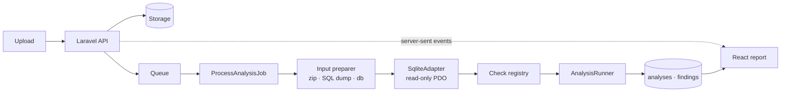

# check-db

**A data-quality audit for SQLite files.** Upload a `.db`, and it is checked against
its own schema — foreign keys, declared types, primary keys, indexes — then reported
back with a score, a per-check breakdown, and the exact row behind every finding.

🔗 **[Live demo](https://check-db-production.up.railway.app)** — the landing page runs
it on a bundled sample database, no upload needed.

---

## Why it exists

SQLite will store whatever you give it. A column declared `REAL` accepts the string
`"pending"`. `NOT NULL` is satisfied by an empty string. Foreign keys are only enforced
if the connection opted in — and most exports did not. The result is a file that opens
fine and reads fine, right up until a `SUM()` returns nonsense or a join silently
drops rows.

This tool looks for exactly those problems, and it needs to know nothing about your
application to do it: every check is driven by the schema inside the file you upload.

## What it checks

| Check | What it finds |
|---|---|
| Storage integrity | A corrupted or truncated file, via SQLite's own `integrity_check` |
| Foreign key violations | Rows pointing at parents that no longer exist, discovered through `foreign_key_check` |
| Type mismatches | Text sitting in a column whose declared affinity is numeric |
| Empty values | `NOT NULL` columns filled with blanks; nullable columns never populated |
| Duplicate rows | Rows identical once the primary key is ignored |
| Missing primary keys | Tables that cannot be addressed or updated row by row |
| Unindexed foreign keys | SQLite never indexes the child side, so joins and parent deletes become scans |
| Constant columns | One value in every row — a field nobody ever used |
| Empty tables | Defined in the schema, never populated |

Checks run in profiles (`quick`, `standard`, `thorough`) and a `crawl` profile adds two
checks for website-crawler exports, which skip themselves when the schema doesn't match.

## How the score works

The score is **the weighted share of checks that came back clean**, not a count of
findings:

```
score = 100 × (1 − Σ weight(failed check) × severity_cost / Σ weight(check run))
```

A critical result costs a check's full weight, a warning 40% of it, and informational
findings cost nothing. Skipped checks are excluded rather than counted as passes.

This matters because the obvious alternative — scoring by how many rows are affected —
makes results incomparable: a 200-row file with two problems would score 0 while a
20-million-row file with five hundred would score 99. Here the same problems produce
the same score at any scale, so two runs can be read against each other.

## Architecture



A few decisions worth calling out:

- **Findings are stored language-neutral** — a translation key plus its parameters —
  so switching the UI between English and Ukrainian re-renders existing results
  instead of re-running the audit.
- **The uploaded file is opened read-only** (`PRAGMA query_only`, `trusted_schema=OFF`),
  and every identifier from its schema is quoted before it reaches a query, because
  table and column names in an uploaded file are attacker-controlled input.
- **Counts are aggregated in SQL.** Histograms group on an indexed `bucket` column
  rather than paging findings to the browser to be tallied there.
- **Checks isolate failures per table**, so one virtual or `WITHOUT ROWID` table
  cannot abort a whole run.
- **Adding a check** means implementing `DbCheck`, registering it in
  `config/db_audit.php`, and adding its title to `lang/*/checks.php`. Nothing in the
  frontend changes — it reads the catalogue from `/api/meta`.

## Stack

Laravel 12 · PHP 8.3 · React 19 · Tailwind v4 · MySQL + Redis (dev) · Docker

## Running it locally

```bash
git clone git@github.com:Aberfort/check-db.git
cd check-db
cp .env.example .env
docker compose up -d
docker compose exec app composer install
docker compose exec app php artisan key:generate
docker compose exec app php artisan migrate
docker compose exec app php artisan db:make-sample
```

The app is at **http://localhost:8085**, the Vite dev server at **http://localhost:5173**.

## Tests

```bash
docker compose exec app php artisan test
```

Each check is tested against a purpose-built in-memory SQLite fixture, including the
cases it must *not* flag — text dates in a `DATETIME` column are normal SQLite usage,
not a type error, and flagging them would bury the real findings.

## API

| Method | Endpoint | |
|---|---|---|
| `GET` | `/api/meta` | Profiles and the check catalogue, translated |
| `POST` | `/api/analyses` | Upload a file (`file`, `profile`) |
| `POST` | `/api/analyses/sample` | Audit the bundled sample |
| `GET` | `/api/analyses/{id}` | Status and summary |
| `GET` | `/api/analyses/{id}/events` | Progress as server-sent events |
| `GET` | `/api/analyses/{id}/findings` | Paginated findings, `?lang=uk` for Ukrainian |
| `GET` | `/api/analyses/{id}/findings/summary` | Counts aggregated in SQL |
| `GET` | `/api/analyses/{id}/findings/export` | CSV |

All endpoints accept `?lang=en|uk`. Uploads are rate-limited per IP.

## Deployment

`docker/prod/Dockerfile` builds a single self-contained image — frontend assets
compiled, dependencies installed without dev packages, SQLite for the app's own
storage — used by the Railway deployment behind the demo link.

## Licence

MIT
